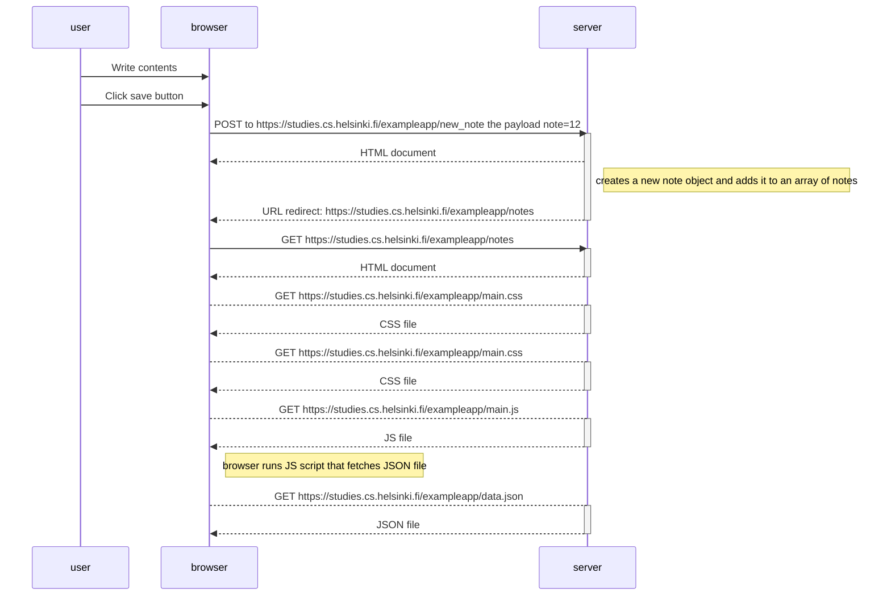

# Sequence Diagram for New Note

Assignment (Sequence Diagram for `https://studies.cs.helsinki.fi/exampleapp/notes`)

```mermaid
sequenceDiagram
    participant user
    participant browser
    participant server

    user->>browser: Write contents

    user->>browser: Click save button

    browser->>server: POST to https://studies.cs.helsinki.fi/exampleapp/new_note the payload note=12

    activate server
    server-->>browser: HTML document

    Note right of server: creates a new note object and adds it to an array of notes

    server-->>browser: URL redirect:  https://studies.cs.helsinki.fi/exampleapp/notes
    deactivate server

    browser->>server: GET https://studies.cs.helsinki.fi/exampleapp/notes

    activate server
    server-->>browser: HTML document
    deactivate server

    browser-->server: GET https://studies.cs.helsinki.fi/exampleapp/main.css
    activate server
    server-->>browser: CSS file
    deactivate server

    browser-->server: GET https://studies.cs.helsinki.fi/exampleapp/main.css
    activate server
    server-->>browser: CSS file
    deactivate server

    browser-->server: GET https://studies.cs.helsinki.fi/exampleapp/main.js
    activate server
    server-->>browser: JS file
    deactivate server

    Note right of browser: browser runs JS script that fetches JSON file

    browser-->server: GET https://studies.cs.helsinki.fi/exampleapp/data.json
    activate server
    server-->>browser: JSON file
    deactivate server

```